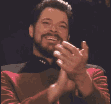

# Electronic Learning Session 1: Circularity Deck Design Challenge

Welcome! In this session you will:

-   get to know the **Circularity Deck**,
-   pick a **design challenge**,
-   apply the Circularity Deck to your design challenge, and
-   **brainstorm ideas** to improve the circularity of your chosen design challenge.

## 1. Some Orga to Begin With

In case you have not done it yet, please form **groups of two** for this session. You can find the groups list here (on Teams):

🔗 [ICE Groups.xlsx](https://imcfhkrems.sharepoint.com/:x:/r/teams/LV_78861/Shared%20Documents/General/ICE_Groups.xlsx?d=wceb5e319044c4c189cf04e6d8339bf87&csf=1&web=1&e=nfrcZJ)

👉 Please remember your **group number** — you will need it throughout this session.

## 2. What is the circularity Deck?

During his PhD **Jan Konietzko** developed a card deck to support the design of circular products and services. The deck contains 36 cards, each representing a different circular strategy. You can find more information about the deck here:

🔗 [Circularity Deck](https://www.circularitydeck.com/)

But let's listen to Jan himself explaining the Circularity Deck:



🤔 So ... what's next?

## 3. Let's pick a Design Challenge!

In this session you will work on a design challenge using the Circularity Deck. The main goal is to further improve the circularity of a given product or service. To do so, you have to pick one of the following design challenges:

We want to improve the circularity of ...

1.  ... a **washing machine** (something like [**this**](https://www.miele.at/product/12703560))
2.  ... a **folding bicycle** (something like [**this**](https://www.brompton.com/c-line))
3.  ... the Mensa (canteen) at our IMC campus Krems (see [**here**](https://www.mensen.at/standort/mensa-campus-krems/))
4.  ... of a roasting company & coffee shop (something like [**this**](https://kaffeecampuskrems.at/))

Have you picked your design challenge? Great!

Let's move on ...

## 4. Check out your Design Challenge!

Before you start brainstorming ideas, take some time to **understand the current state of your chosen design challenge**. Familiarise yourself with the selected product or service, and consider whether any **R-strategies** have already been applied in its current design. Document your findings (e.g. as a note on the Miro board linked below), as this will help you identify areas for improvement and guide your brainstorming session.

## 5. Applying the Circularity Deck to your Design Challenge

Now it’s time to get creative! Using the Circularity Deck, brainstorm ideas to improve the circularity of your chosen design challenge. Since this is a self-guided learning session, we’ll use the online version of the Circularity Deck – a **pre-structured Miro board**. You can find your group’s (remember your group number?) Miro board here:

-   Group 1: [🔗 to Miro-board](https://miro.com/app/board/uXjVJs5thco=/?share_link_id=935520601999)
-   Group 2: [🔗 to Miro-board](https://miro.com/app/board/uXjVJs5QO00=/?share_link_id=690298094638)
-   Group 3: [🔗 to Miro-board](https://miro.com/app/board/uXjVJs58mSE=/?share_link_id=28498535766)
-   Group 4: [🔗 to Miro-board](https://miro.com/app/board/uXjVJs58mdI=/?share_link_id=133988299123)
-   Group 5: [🔗 to Miro-board](https://miro.com/app/board/uXjVJs58mYQ=/?share_link_id=874810911468)
-   Group 6: [🔗 to Miro-board](https://miro.com/app/board/uXjVJs58mYo=/?share_link_id=576137385780)
-   Group 7: [🔗 to Miro-board](https://miro.com/app/board/uXjVJs58mbY=/?share_link_id=235327138449)
-   Group 8: [🔗 to Miro-board](https://miro.com/app/board/uXjVJs58nkM=/?share_link_id=929933775874)
-   Group 9: [🔗 to Miro-board](https://miro.com/app/board/uXjVJs58nko=/?share_link_id=530085001300)
-   Group 10: [🔗 to Miro-board](https://miro.com/app/board/uXjVJs58nl0=/?share_link_id=511849650776)
-   Group 11: [🔗 to Miro-board](https://miro.com/app/board/uXjVJs58nnU=/?share_link_id=591616736696)
-   Group 12: [🔗 to Miro-board](https://miro.com/app/board/uXjVJs58nnk=/?share_link_id=321393453560)

👉 Please note that you will need the **password provided in our Teams channel** to access these boards. Make sure to **work only in your group’s board**.

After opening your group-specific Miro board, I recommend watching the following **video tutorial** by Jan Konietzko. In this video, he explains how to use the board-based version of the Circularity Deck effectively. You can find the tutorial on top of the board, but for your convenience, I've also embedded it below:



## 6. Some Recommendations for your Brainstorming Session

To make the most out of your brainstorming session using the Circularity Deck, here are some recommendations:

-   Put an **image of your chosen design challenge** (washing machine, folding bike, canteen, coffee shop) on the Miro board to visualise the challenge you are working on.
-   **Familiarise Yourself with the Cards:** Before diving into brainstorming, take a few minutes to go through the cards on the Miro board. Understand the different circular strategies represented by each card. This will help you think more creatively during the session. To get more information on a specific card, simply click on the "info" icon located at the top right of each card:

-   **Set a Time Limit:** Allocate a specific amount of time for your brainstorming session (e.g. 30-45 minutes). This will help keep the session focused and productive. You can also go for a second round if you feel the need for more ideas.
-   **Use Sticky Notes:** Use sticky notes on the Miro board to jot down your ideas. This will help you keep track of your thoughts and make it easier to organize them later. As a rule of thumb: **one idea per sticky note**.
-   **Build on Each Other's Ideas:** Encourage collaboration within your group. Build on each other's ideas to create more comprehensive solutions.
-   **Encourage Wild Ideas:** Don't be afraid to think outside the box. Sometimes, the most unconventional ideas can lead to innovative solutions.

## 7. Reviewing and Selecting Ideas

After your brainstorming session, take some time to **review the ideas** generated. Discuss the **feasibility and potential impact** of each idea. Select the most promising ones to further develop and refine. Put the most promising ideas around the "Circular Strategies" area on the Miro board and the less promising ones outside this area.

## 8. Wrapping Up

**👉 You will use this Miro board in our next session to present your ideas and discuss them with your classmates.** So make it pretty 😉

Thanks for reading till the end and congratulations for finishing this electronic learning session! 🎉

